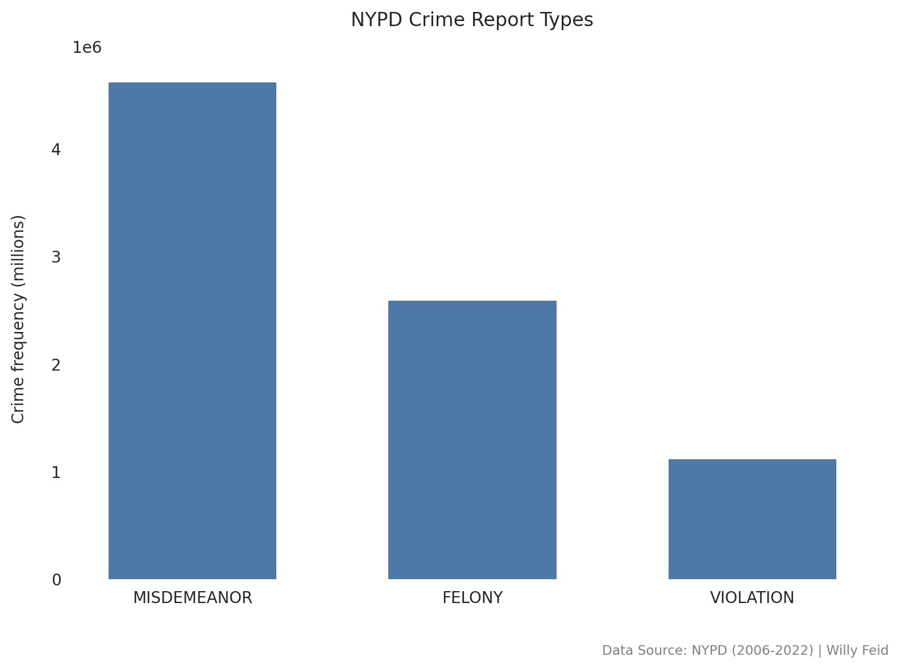
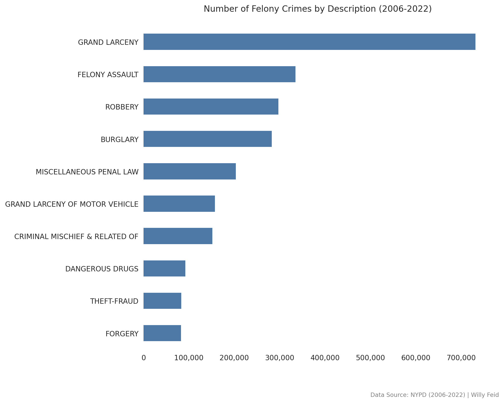
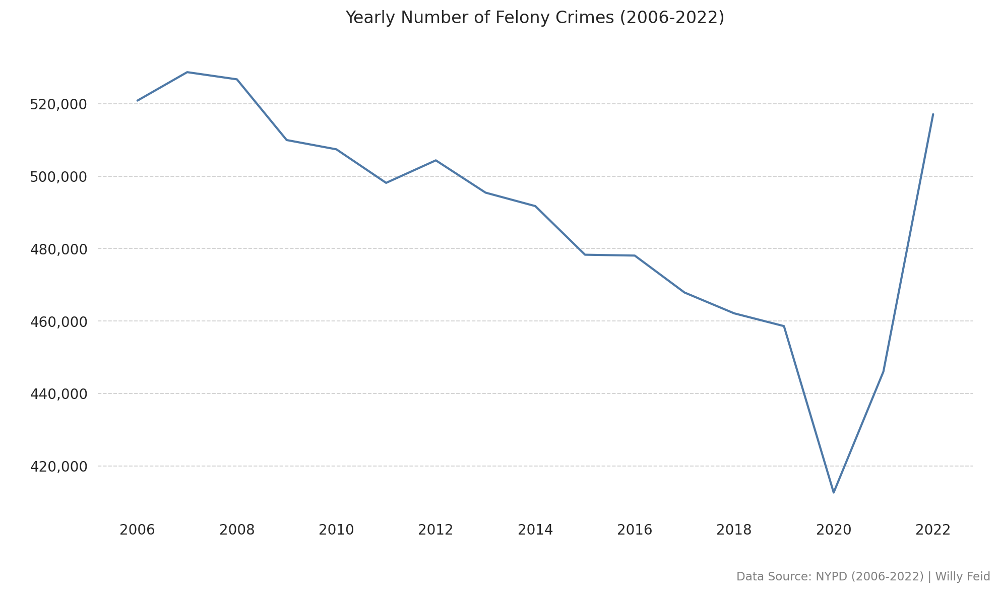
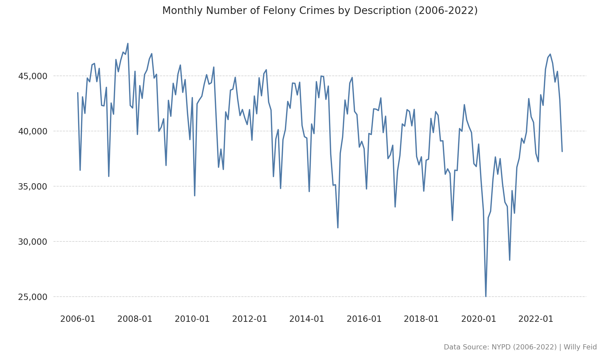
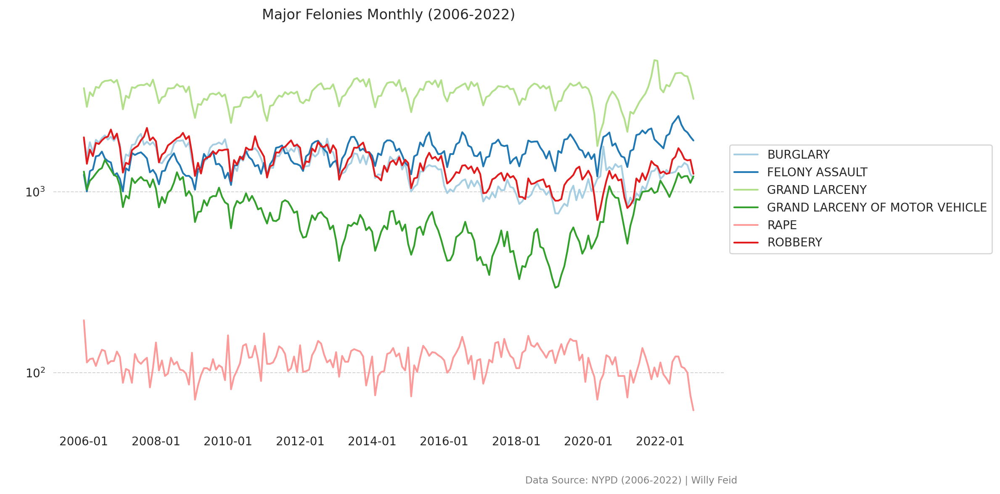
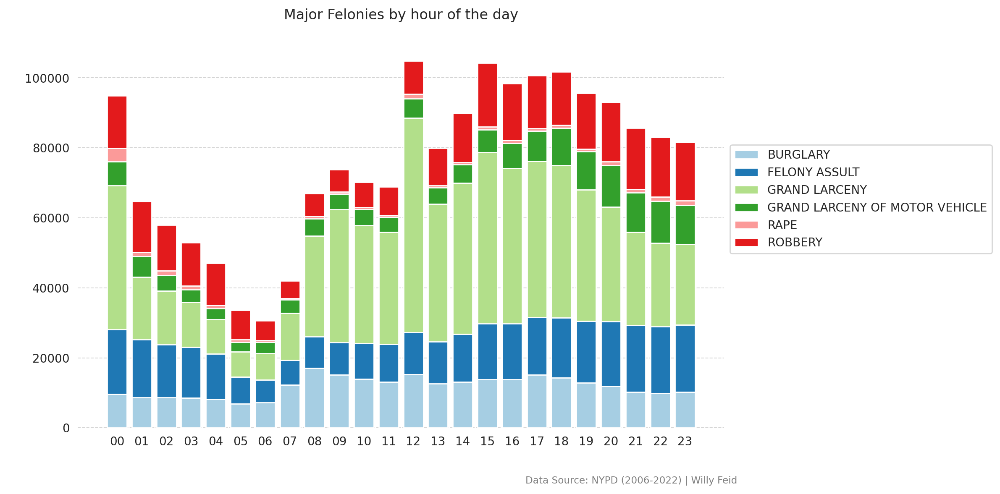
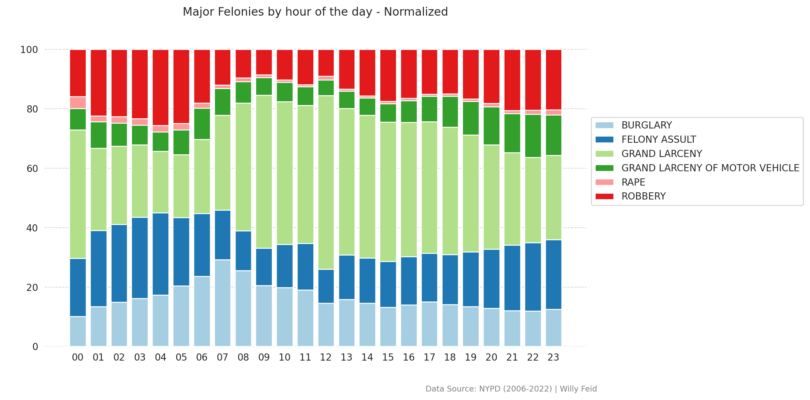
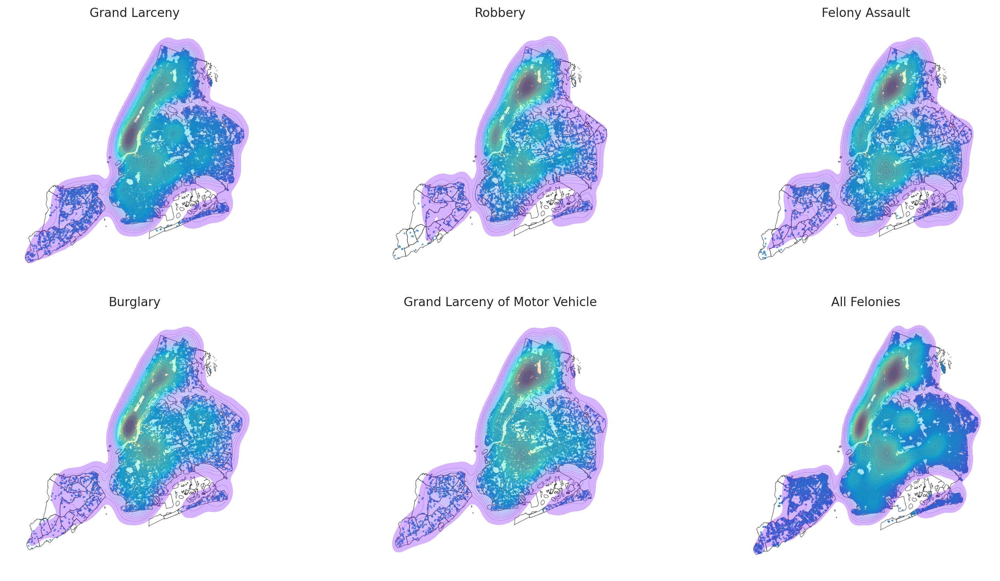

# NYPD Crimes Report Analysis

## Introduction
This project is an exploration and analysis of the New York Police Department (NYPD) crimes report dataset, which encompasses all valid felony, misdemeanor, and violation crimes reported in New York City from 2006 to 2022. The dataset contains approximately 8 million reported crimes and is publicly available from the [NYC Open Data portal](https://data.cityofnewyork.us/Public-Safety/NYPD-Complaint-Data-Historic/qgea-i56i).

## Objective
The goal of this project is to uncover insights from the dataset through various analytical methods. The analysis is conducted using Python in a Colab notebook, with SQL queries to pull data from the database.

## Analysis Overview
The analysis is divided into five main sections, each addressing key questions about the composition and trends of crime in NYC:

### 1. Composition of Crimes
- Total number of reported crimes in the dataset.
- Breakdown of reported crimes among Felony, Misdemeanor, and Violation.
- Top-10 most reported felony crimes.

### 2. Trends in Crime Over Time
- Yearly trend of all reported crimes.
- Monthly frequency of all reported crimes.

### 3. Major Felonies Analysis
- Reporting the number of crimes over time broken down by type of major felony.

### 4. Analysis of Major Felonies by Hour of Day
- Hourly distribution of major felonies.
- Normalized comparison of major felonies by hour.

### 5. Spatial Analysis
- Geographical distribution of crimes within NYC.
- Density plots for each major felony type overlaid on the NYC map.

## Visualizations
The following plots were generated as part of the analysis and are included in the repository:

---

 

   ---

   ---

Overall crime reports were on a steady downward trend from 2006 to 2019, with a sharp decline in 2020 due to Covid restrictions. Crime spiked dramatically after Covid restrictions were lifted.

   ---

The monthly frequency graph shows clear seasonal trends in crime as crime reports decrease in winter months and reach highs during the summer months.

   ---

The breakdown of felony type shows the same seasonality trends across all felony types.

   ---

The peak hours of the day for reported crimes seem contrary to popular belief that crime would be most frequent in the late hours of the night. This shows crime reports are most frequent at noon and between the hours of 3pm and 6pm.
   
   ---

 
 The majority of reported crimes that occur in the middle of the day is grand larceny (~50%), while burglary, felony assault, and robbery are more frequent at night time and early morning.

   ---

 
 Upper Manhatten and Lower Manhatten are where most of the crime reports occur.

 ---

## Tools and Technologies
- **Python**: Data analysis and visualization.
- **SQL**: Data extraction from the database.
- **Colab Notebook**: Interactive development environment.
- **Pandas & Matplotlib**: Data manipulation and plotting.
